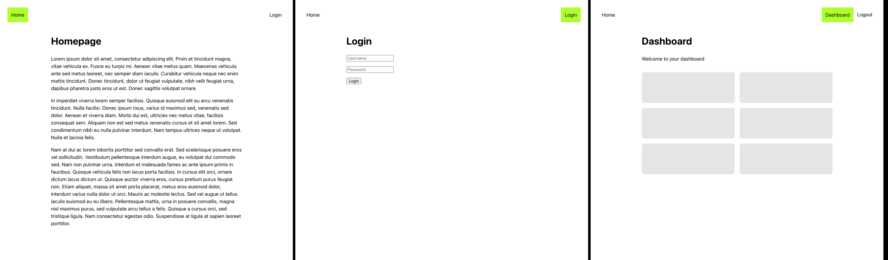

# Vue 3 Example: Route Guards

A Vue 3 example of how to use route guards to redirect users to the login page if they are not authenticated. This example uses Vue Router and Pinia for state management.

## Run the project locally

> This project uses Node 18+  
> [Created using Vite and the Vue 3 template.](https://vitejs.dev/guide/#scaffolding-your-first-vite-project)

1. Clone or download the repo to your local machine
1. Navigate to the project root using your terminal
1. Run `npm i` to install the project dependencies
1. Run `npm run dev` to start the development server

## Want to learn more?

Follow along at [rebz.me](https://rebz.me) for more Vue 3 examples, videos, tutorials.